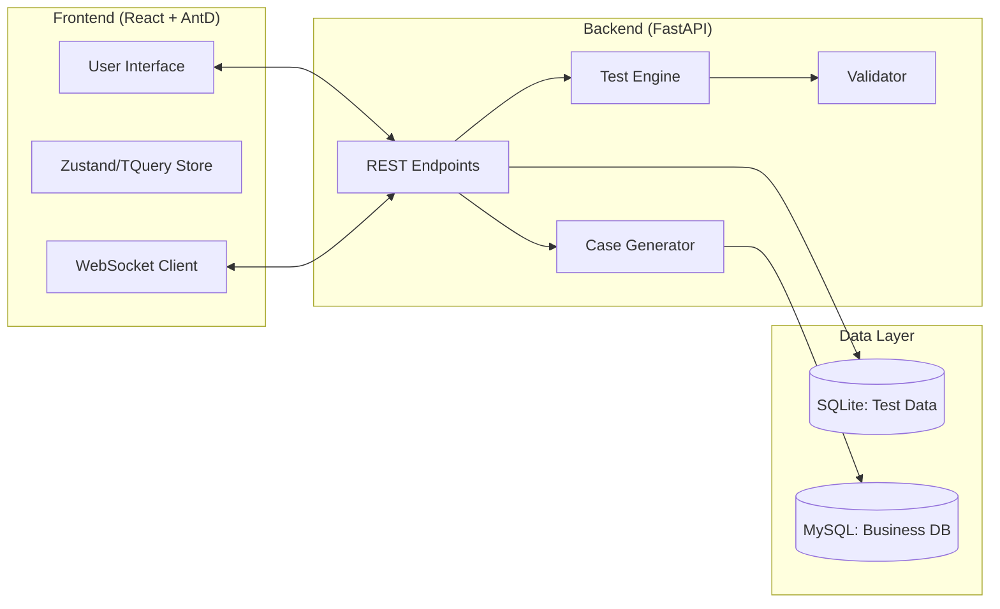

# Helix AutoTest 系统架构文档 (V6.0)

## 1. 系统总览
Helix AutoTest 是一个全栈接口自动化测试平台，专为 AI 机器人测试设计。系统采用前后端分离架构，集成了用例生命周期管理、自动化执行引擎和实时监控能力。



---

## 2. 后端架构 (Backend)
位于 `apiautotest/backend/`，基于 **FastAPI** 构建。

### 核心模块
- **Routers**:
  - `cases.py`: 用例增删改查及批量导入。
  - `runner.py`: 执行引擎入口，支持 BackgroundTasks 和 WebSocket。
  - `generator.py`: 集成 `DataFetcher` 从业务库刷新元数据并生成用例。
  - `reports.py`: 历史结果查询与导出。
- **Core Engine**:
  - `TestEngine`: 模拟用户行为，处理 SSE 流并提取 SQL。
  - `Validator`: 基于关键词和 JSON 指标的校验引擎。
  - `DataFetcher`: 业务数据库连接器，负责元数据同步。
- **Persistence**: 使用 **SQLAlchemy** 管理 SQLite 数据库，存储测试定义和历史结果。

---

## 3. 前端架构 (Frontend)
位于 `apiautotest/frontend/`，基于 **React 18 + Vite** 构建。

### 技术栈
- **UI 组件**: Ant Design 5.x (中后台标准)。
- **状态管理**: 
  - **Zustand**: 维护执行进度、日志流等运行时状态。
  - **TanStack Query (React Query)**: 处理服务端数据缓存与同步。
- **样式**: Tailwind CSS (原子类布局) + AntD Token (组件主题)。

### 关键分层
- `src/services/`: 封装所有 API 请求。
- `src/pages/`: 业务页面（用例管理、控制台、报告中心、智能生成）。
- `src/stores/`: 客户端持久化与状态共享。

---

## 4. 关键业务流

### 4.1 智能用例生成
1. 调用 `DataFetcher` 连接业务库。
2. 提取指标 (Indicators) 和公司 (Companies) 元数据。
3. `CaseGeneratorService` 组装自然语言提问语（P0 基础提问，P1 组合提问）。
4. 存入本地测试仓库及其预期校验点。

### 4.2 实时测试执行
1. 前端通过 `POST /run` 触发批次运行。
2. 后端返回 `batch_id` 并启动后台任务。
3. 前端建立 `ws://.../run/ws/{batch_id}` 连接。
4. 后端每完成一个用例，均通过 WebSocket 推送更新：
   - `type: running`: 告知当前运行项。
   - `type: update`: 推送结果、执行时长及比对信息。
   - `type: done`: 执行结束信号。

---

## 5. 项目结构 (最新)
```text
D:\codespace\helix_autotest\apiautotest\
├── backend/                # FastAPI 源码
│   ├── app/                # 路由、模型、验证架构
│   └── core/               # 核心引擎 (Engine, Validator, Fetcher)
├── frontend/               # React + TypeScript 源码
│   ├── src/                # 组件、页面、服务、状态
│   └── vite.config.ts      # 代理与构建配置
├── data/                   # 本地数据库与报告存储
└── docs/                   # 项目文档与技术方案
```
