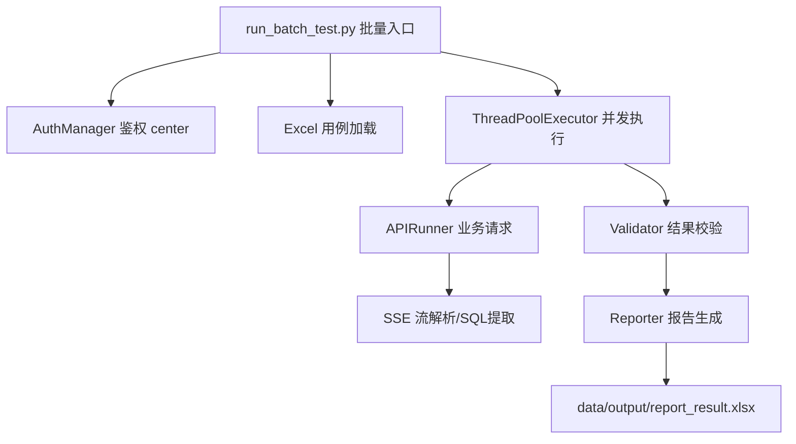

# 🤖 API-AutoTest: 智能接口自动化测试平台 (V5.0)

[](https://www.python.org/)
[]()
[]()

> 一款专为 AI 问答机器人设计的接口自动化测试平台，支持用例管理、自动执行与报告生成。
> **V5.0 版本引入了“API 定义中心”，实现接口配置与执行逻辑的彻底解耦。**

---

## 🌟 核心特性 (V5.0)

- 🧩 **接口定义中心 (New)** - 独立的接口模板管理，支持多版本/多环境，一处修改，全局生效。
- 🔐 **动态鉴权配置** - 支持 Bearer/ApiKey/Custom 等多种鉴权方式的灵活配置。
- ⚡ **实时调试预览** - 模板编辑时即可实时发送请求，查看渲染后的 Header/Body 及响应结果。
- 📊 **可视化报告** - 自动生成带样式的 Excel 测试报告，结果一目了然。
- 🚀 **异步批量执行** - 基于 FastAPI BackgroundTasks 的异步执行引擎，支持 WebSocket 实时进度推送。
- 🔄 **数据导入导出** - 支持 Excel/CSV 用例导入及测试历史导出。

---

## 🏗️ 项目架构



---

## 📂 目录结构

```text
d:\apiautotest\
├── src/                    # 核心源码
│   ├── auth.py             # 登录鉴权逻辑 (含 Ticket 换 Token)
│   ├── api_runner.py       # 业务接口交互 (SSE + SQL递归提取)
│   ├── validator.py        # SQL 准确性匹配引擎
│   ├── reporter.py         # Excel 报告生成工具
│   └── config.py           # 全局环境配置
├── data/                   # 数据文件
│   ├── input/              # 测试用例 (如 test_3_cases.xlsx)
│   └── output/             # 测试报告 (Excel)
├── run_batch_test.py       # 【推荐】批量测试启动入口
├── main.py                 # 旧版入口 (保留)
├── requirements.txt        # 依赖包清单
└── 修改记录_V3.0.md        # 版本更新详细记录
```

---

## 🚀 快速开始

### 1. 环境准备
确保已安装 Python 3.8+，执行以下命令安装依赖：
```bash
pip install -r requirements.txt
```

### 2. 参数配置
编辑 `src/config.py` 确认测试数据路径：
```python
# 指定测试用例文件
INPUT_FILE = r"D:\apiautotest\data\input\test_3_cases.xlsx"

# 登录账号配置
LOGIN_ACCOUNT = "13439427048"
# ...
```

### 3. 运行批量测试
使用 V3.0 新增的批量测试脚本：
```powershell
python run_batch_test.py
```

### 4. 查看报告
测试结束后，报告将生成于：`D:\apiautotest\data\output\report_result.xlsx`

---

## 📝 V3.0 稳定性改进说明

针对之前版本出现的“无法获取数据”、“鉴权失败”等问题，V3.0 进行了以下关键修复：

1.  **网络层优化**：显式禁用了 `requests` 的系统代理设置，防止请求被本地代理 (如 Charles/Fiddler) 拦截导致超时。
2.  **Header 修正**：严格对齐了浏览器行为，特别是 `Referer` 字段补充了 `web-dashboard` 路径，防止被服务端拦截。
3.  **SQL 解析增强**：不仅支持标准的 JSON 字段提取，还增加了对 **字符串内嵌 SQL** (如 `sql: SELECT...`) 的解析支持，解决了部分场景下无法提取 SQL 的问题。

---

## 🔗 常见问题

- **Q: 为什么提示 'no such table'？**
  - A: 这是业务系统的正常返回，说明 SQL 语法正确但表不存在。**只要提取到了 SQL，测试框架即视为“成功获取”**。断言失败是因为预期关键字不匹配。
- **Q: 登录超时怎么办？**
  - A: 检查网络是否正常，或在 config.py 中增加 `LOGIN_TIMEOUT`。

---

## 🛠️ 技术栈
- **HTTP Client**: [requests](https://requests.readthedocs.io/)
- **Concurrency**: [concurrent.futures](https://docs.python.org/3/library/concurrent.futures.html)
- **Data Engine**: [pandas](https://pandas.pydata.org/)
