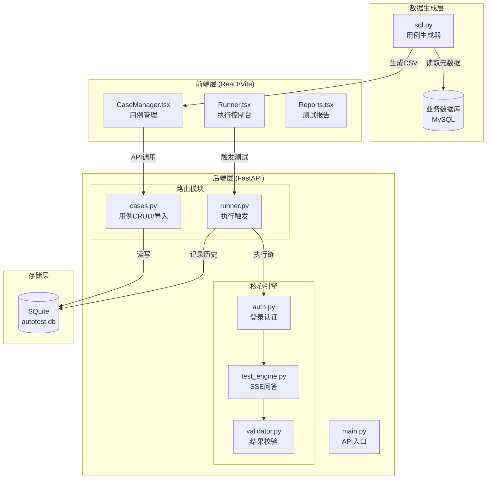

# 智能接口自动化测试平台 V4.0 - 系统全局描述

**项目名**: `helix_autotest`
**版本**: V4.0 (Web Platform)
**架构**: FastAPI + React/Vite + SQLite
**状态**: 开发中

---

## 1. 系统架构概览



---

## 2. 模块说明

### 2.1 数据生成层 (`data/sqltocase/`)

| 文件 | 功能 | 输出 |
|-----|------|-----|
| `sql.py` | 连接业务数据库，提取公司/指标元数据，自动生成测试用例 | `auto_generated_cases_db.csv` |

**输出字段标准**:
- `question`: 测试问句
- `expected_keywords`: 预期关键字 (逗号分隔)
- `expected_conditions`: 预期条件 (逗号分隔)

---

### 2.2 前端层 (`frontend/src/`)

| 页面 | 路由 | 功能 |
|-----|------|-----|
| `CaseManager.tsx` | `/` | 用例列表、新增、编辑、删除、Excel/CSV 导入 |
| `Runner.tsx` | `/runner` | 触发测试执行、轮询日志、Pass/Fail 统计 |
| `Reports.tsx` | `/reports` | 历史批次查看 (待完善 SQL Diff) |

---

### 2.3 后端层 (`backend/`)

#### API 路由 (`app/routers/`)

| 路由 | 方法 | 功能 |
|-----|------|-----|
| `/cases/` | GET | 获取用例列表 |
| `/cases/` | POST | 创建用例 |
| `/cases/{id}` | PUT | 更新用例 |
| `/cases/{id}` | DELETE | 删除用例 |
| `/cases/import` | POST | 上传 CSV/Excel 导入用例 |
| `/run/` | POST | 触发后台测试任务 |
| `/run/history/{batch_id}` | GET | 获取批次执行日志 |

#### 核心引擎 (`core/`)

| 模块 | 职责 |
|-----|------|
| `auth.py` | 登录认证，获取 Token 和 Tenant ID |
| `test_engine.py` | 发送 SSE 问答请求，解析响应提取 SQL |
| `validator.py` | 验证实际 SQL 是否包含预期关键字/条件 |
| `config.py` | 动态配置管理 (支持从 DB 加载) |

---

### 2.4 数据模型 (`app/models.py`)

| 表名 | 用途 |
|-----|------|
| `test_cases` | 测试用例存储 |
| `test_batches` | 测试批次聚合 (UUID, 状态, 统计) |
| `test_history` | 单条执行记录 (关联 batch_id) |
| `system_config` | 系统配置键值对 |

---

## 3. 数据流

```text
[sql.py] 生成 CSV
    ↓ 手动上传
[前端 /cases/import] 
    ↓ API
[后端 cases.py] 解析 CSV → 写入 SQLite
    ↓
[前端 /runner 点击执行]
    ↓ API
[后端 runner.py] BackgroundTask 启动
    ↓
[auth.py] 登录获取 Token
    ↓
[test_engine.py] SSE Ask → 提取 SQL
    ↓
[validator.py] 校验 → 记录到 test_history
    ↓
[前端轮询 /run/history] 展示日志
```

---

## 4. 待实现功能
控制用例的执行：控制输入的用例，控制执行的批次自动生成对应的用例然后导入再执行
- [ ] **配置管理 API** (`/config` GET/POST)
- [ ] **WebSocket 实时日志** (`/ws/logs/{batch_id}`)
- [ ] **停止测试** (`/run/stop`)
- [ ] **SQL Diff 对比视图** (前端)
- [ ] **一键重试失败用例**
